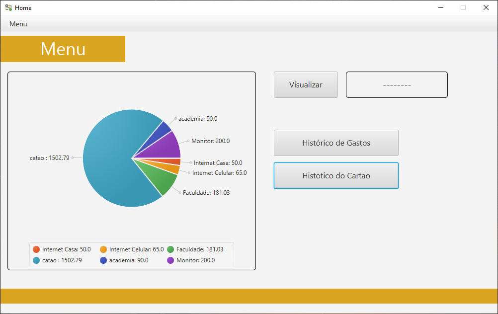
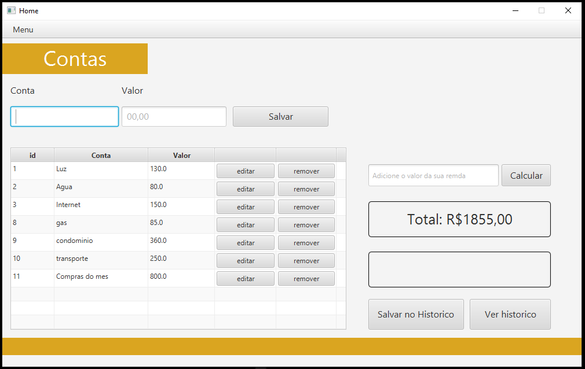

# Controle-de-Gastos

O objetivo principal deste programa é facilitar o controle de gastos, tornando-o mais simples e acessível. Ele oferece automação em alguns processos, como a soma total no final do mês e uma visualização gráfica dos gastos por meio de um gráfico de pizza, tornando mais fácil identificar onde estão os maiores gastos.

## Bibliotecas Utilizadas
logback: Ferramenta de registro (logging) em Java, utilizada para gerar logs de maneira flexível e eficiente.

slf4j: (Simple Logging Facade for Java) é uma API de abstração de logging para a linguagem Java, permitindo que você utilize diferentes frameworks de logging de forma intercambiável.

sqlite-jdbc: Driver JDBC (Java Database Connectivity) que permite que aplicativos Java se conectem a bancos de dados SQLite.

## Banco de Dados Utilizado: SQLite
SQLite é um sistema de gerenciamento de banco de dados relacional leve e autossuficiente, amplamente usado por ser embutido e não requerer a instalação de um servidor de banco de dados.

## Como Executar o Projeto

1. **Crie um novo projeto Java**: Use a IDE de sua escolha.
2. **Substitua a pasta `src`**: Navegue até a pasta `src` do seu projeto e substitua-a pelo `src` deste repositório.
3. **Compile e execute o código**.
4. **Bibliotecas**: Certifique-se de baixar as bibliotecas necessárias.
5. **Banco de Dados**: Se estiver usando um banco de dados diferente, modifique a classe `DB` conforme necessário.
# Controle-de-Gastos
